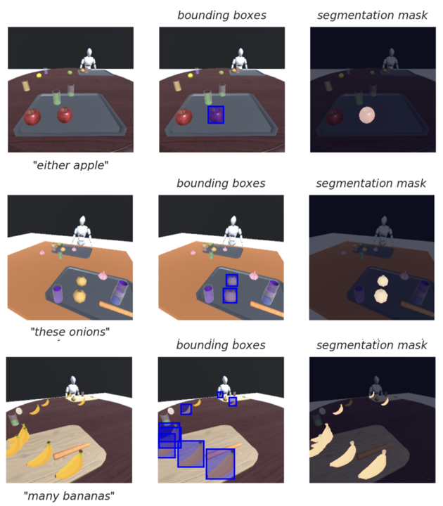

# DetermiNet
## Dataset Description
- **Paper:** [insert paper link here]()
- **Point of Contact:** 
  - Clarence: clarence_leesheng@mymail.sutd.edu.sg 
  - Ganesh: m_ganeshkumar@u.nus.edu
- **Supervisor**
  - Cheston Tan: cheston-tan@i2r.a-star.edu.sg

### DetermiNet Dataset 
State-of-the-art visual grounding models can achieve high detection accuracy, but they are not designed to distinguish between all objects versus only certain objects of interest. In particular, determiners are an important word class that is used in the referencing and quantification of nouns. Existing datasets place much less emphasis on determiners, compared to other word classes. In order to address this, we have designed the DetermiNet dataset, a synthetically generated dataset comprising of 250,000 grounded image caption pairs. The task is to predict bounding boxes to identify objects of interest, constrained by the semantics of the determiners  

<p align="center">

</p>


### Downloading the dataset: 
  - Download the images here: https://sutdapac-my.sharepoint.com/:u:/g/personal/clarence_leesheng_mymail_sutd_edu_sg/EZdzhZvzLmxDkCvMAsbV_M4BmUkrVfgRx9HMzFLumzvT_A?e=8kyXgZ 

### Dataset Summary

DetermiNet is a visuolinguistic dataset comprising of the word class determiners. It contains 25 determiners with 10000 examples each, totalling 250,000 samples. All scenes were synthetically generated using unity.

Metrics is measured in AP @ 0.5:0.95 based on [pycocotools](https://pypi.org/project/pycocotools/)

### Dataset Structure

All data fields are based on the COCO annotation format. Refer to this link for more information: https://cocodataset.org/#home, We add the "input_oracle_annotations" field  to provide annotations for all bounding boxes per image to train the neurosymbolic model for DetermiNet.

```
{
    'input_oracle_annotations':[
        {
            "id": ...,
            "image_id": ...,
            "category_id": ...,
            "area": ...,
            "bbox": ...,
            "iscrowd": ...
        }, 
        ...
    ],
    'annotations':[
        {
            "id": ...,
            "image_id": ...,
            "category_id": ...,
            "area": ...,
            "bbox": ...,
            "iscrowd": ...
        }, 
        ...
    ]
}
```

### Setup 
- Setup Unity Hub as per https://docs.unity3d.com/hub/manual/InstallHub.html
- Install Unity Editor 2021.3.9f1
- Install required packages
1. install requirements 
```
pip install -r requirements.txt 
``` 
2. run setup.py
```
// assume in root directory of the repository 
cd DetermiNetProject/Assets/utils
python setup.py
```

## Generating the dataset
#### Through the Unity Editor 
1. open up the unity project under "DetermiNetProject" directory 
2. Setup the resolution to the image resolution that you want to generate (256 x 256) under the "Game" Tab 

3. Set field of view to 75 on main camera and add ImageSynthesis component to it 
4. Create a 3D plane object as the floor with the following specifications: 
- position X: 0, Y: 0, Z: 0
- rotation X: 0, Y: 0, Z: 0
- scale X: 3.5, Y:3.5, Z: 3.5
5. Create a plane object as the scene background with the following specifications: 
- position X: 0, Y: 0, Z: 17
- rotation X: 270, Y: 0, Z: 0
- scale X: 12, Y:12, Z: 12
6. Give the planes a dark colour by applying the materials in the Resources/materials tab under Assets
7. Click play on the unity editor to run the generation script 


## Retraining the models 
### Neurosymbolic model
This section elaborates how you can rerun the Neuro-symbolic model which were explained 

### MDETR/OFA
For [MDETR](https://github.com/ashkamath/mdetr) and [OFA](https://github.com/OFA-Sys/OFA), you may refer to the repositories in the link to run the baseline models. we have also included the json files that we used in the preprocessed_data directory 

## Evaluation scripts 
### Evaluating baselines 
To reproduce the results we showed in the paper, you can run coco evaluation for mAP based on the jsons we generated in both ground_truths and predictions directories. 

You may run the following code to see the evaluation results for our Neurosymbolic model, MDETR and OFA 
```
cd evaluation 
python evaluation_baseline.py 
```

### Evaluating on new models using corrected ground truth 
To run on corrected evaluation first save your predictions as specified by the coco format in ./predictions as {model_name}_pred_results.json.

Afterwards, run the evaluation script as below, changing the model_name parameter to your desired name, this script will generate the corrected ground truth file under ground_truths using the model name and evaluate against the predictions in the predictions folder.

```
cd evaluation 
python evaluate.py --model_name=ns
```

### Citation Information

Provide the [BibTex](http://www.bibtex.org/)-formatted reference for the dataset. For example:
```
@article{article_id,
  author    = {Author List},
  title     = {Dataset Paper Title},
  journal   = {Publication Venue},
  year      = {2525}
}
```

If the dataset has a [DOI](https://www.doi.org/), please provide it here.