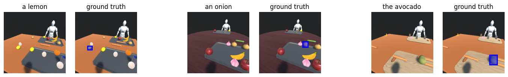
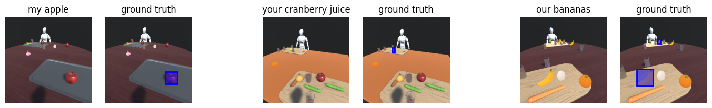
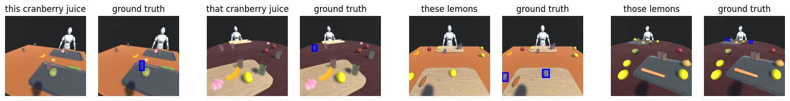

<p align="center" style="font-size:30px; font-weight:bold"> 
DetermiNet: A Large-Scale Diagnostic Dataset for Complex Visually-Grounded Referencing using Determiners
</p>

<div align="center" style="display:flex; justify-content: space-evenly">
   <div>Clarence Lee<sup>1</sup></div>
   <div>M Ganesh Kumar<sup>2</sup></div>
   <div>Cheston Tan<sup>2</sup></div>
</div>

<div align="center" style="display:flex; justify-content:center">
   <div style="margin-right:20px">Design and Artificial Intelligence, SUTD<sup>1</sup></div>
   <div style="margin-left:20px">Centre for Frontier AI Research, A*STAR<sup>2</sup></div>
   <!-- <div>m_ganeshkumar@u.nus.edu</div>
   <div>cheston-tan@i2r.a-star.edu.sg</div> -->
</div>


<br> 

Determiners are an important word class that is used in the referencing and quantification of nouns. However existing datasets place less emphasis on determiners, compared to other word classes. Hence, we have designed the DetermiNet dataset, which is a visuolinguistic dataset comprising of the word class determiners. It comprises of 25 determiners with 10,000 examples each, totalling 250,000 samples. All scenes were synthetically generated using unity. The task is to predict bounding boxes to identify objects of interest, constrained by the semantics of the determiners   

<div align="center">
  <figure>
    <br>
    
  </figure>
</div>

<div align="center" style="font-size:18px; display:flex; justify-content: center">
<a href="test" style="margin-right:15px; margin-left:-15px">[Paper]</a>
<a href="test" style="margin-right:15px">[Supp]</a>
<a href="https://github.com/clarence-lee-sheng/DetermiNet">[Github]</a>
</div>


### Download the Dataset 
You may download DetermiNet comprising of 250,000 image caption pairs here: 
[https://drive.google.com/drive/folders/1J5dleNxWvFUip5RBsTl6OqQBtpWO0r1k?usp=sharing](https://drive.google.com/drive/folders/1J5dleNxWvFUip5RBsTl6OqQBtpWO0r1k?usp=sharing )

### Real Dataset 
Download real dataset comprising of 100 image caption pairs here: [https://drive.google.com/drive/folders/1J5dleNxWvFUip5RBsTl6OqQBtpWO0r1k?usp=sharing](https://drive.google.com/drive/folders/1J5dleNxWvFUip5RBsTl6OqQBtpWO0r1k?usp=sharing )


### Citation Information
```
@article{article_id,
  author    = {Clarence Lee, Ganesh Kumar, Cheston Tan},
  title     = {DetermiNet: A Large-Scale Diagnostic Dataset for Complex Visually-Grounded Referencing using Determiners},
  journal   = {ICCV},
  year      = {2023}
}
```

## Evaluation scripts 
DetermiNet uses a modified ground truth for multiple annotations, to run your models for evaluation, refer to our [github](https://github.com/clarence-lee-sheng/DetermiNet)


### DetermiNet examples

<div align="center">
  <figure>
    <div>
    <h3>Articles</h3>
    
    </div>
    </div>
    <h3>Possessives</h3>
    
    </div>
    <div>
    <h3>Demonstratives</h3>
    
    </div>
  </figure>
</div>

### Contact us
- Clarence Lee: [clarence_leesheng@mymail.sutd.edu.sg]()
- M Ganesh Kumar: [m_ganeshkumar@u.nus.edu]()
- Cheston Tan: [cheston-tan@i2r.a-star.edu.sg]()


<!-- If the dataset has a [DOI](https://www.doi.org/), please provide it here. -->