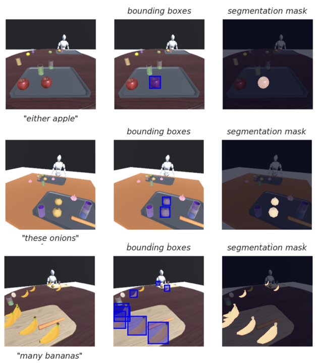

<p align="center" style="font-size:30px; font-weight:bold"> 
DetermiNet: A Large-Scale Diagnostic Dataset for Complex Visually-Grounded Referencing using Determiners
</p>

<br> 


Determiners are an important word class that is used in the referencing and quantification of nouns. However existing datasets place less emphasis on determiners, compared to other word classes. Hence, we have designed the DetermiNet dataset, which is a visuolinguistic dataset comprising of the word class determiners. It comprises of 25 determiners with 10,000 examples each, totalling 250,000 samples. All scenes were synthetically generated using unity. The task is to predict bounding boxes to identify objects of interest, constrained by the semantics of the determiners   

<div align="center">
  <figure>
    <br>
    
  </figure>
</div>

<div align="center" style="font-size:18px; display:flex; justify-content: center">
<a href="test" style="margin-right:15px; margin-left:-15px">[Paper]</a>
<a href="test" style="margin-right:15px">[Supp]</a>
<a href="https://github.com/clarence-lee-sheng/DetermiNet">[Github]</a>
</div>

- **Point of Contact:** 
  - Clarence: clarence_leesheng@mymail.sutd.edu.sg 
  - Ganesh: m_ganeshkumar@u.nus.edu
- **Supervisor**
  - Cheston Tan: cheston-tan@i2r.a-star.edu.sg

### Download the Dataset 
You may download the dataset here: 
[https://drive.google.com/drive/folders/1J5dleNxWvFUip5RBsTl6OqQBtpWO0r1k?usp=sharing](https://drive.google.com/drive/folders/1J5dleNxWvFUip5RBsTl6OqQBtpWO0r1k?usp=sharing )


### Dataset Summary

<div align="center">
  <figure>
    <br>
    
  </figure>
</div>

### Setup 
- Setup Unity Hub as per https://docs.unity3d.com/hub/manual/InstallHub.html
- Install Unity Editor 2021.3.9f1
- Install required packages
1. install requirements 
```
pip install -r requirements.txt 
``` 
2. run setup.py
```
// assume in root directory of the repository 
cd DetermiNetUnity/Assets/utils
python setup.py
```

### Downloading the dataset: 
  - Download the images here: https://drive.google.com/drive/folders/1J5dleNxWvFUip5RBsTl6OqQBtpWO0r1k?usp=sharing 
### Downloading oracle weights 
  - Download the oracle weights here: 

## Generating the dataset
Setup the dataset by referring to the instructions [here](DATASET_SETUP.md)

### Dataset Structure

All data fields are based on the COCO annotation format. Refer to this link for more information: https://cocodataset.org/#home, We add the "input_oracle_annotations" field  to provide annotations for all bounding boxes per image to train the neurosymbolic model for DetermiNet. 

For all evaluation, metrics was measured in AP @ 0.5:0.95 based on [pycocotools](https://pypi.org/project/pycocotools/)

```
{
    'input_oracle_annotations':[
        {
            "id": ...,
            "image_id": ...,
            "category_id": ...,
            "area": ...,
            "bbox": ...,
            "iscrowd": ...
        }, 
        ...
    ],
    'annotations':[
        {
            "id": ...,
            "image_id": ...,
            "category_id": ...,
            "area": ...,
            "bbox": ...,
            "iscrowd": ...
        }, 
        ...
    ]
}
```

## Retraining the models 
### Neurosymbolic model
This section elaborates how you can rerun the Neuro-symbolic model which were explained 

### MDETR/OFA
For [MDETR](https://github.com/ashkamath/mdetr) and [OFA](https://github.com/OFA-Sys/OFA), you may refer to the repositories in the link to run the baseline models. 

## Evaluation scripts 
### Evaluating baselines 
To reproduce the results we showed in the paper, you can run coco evaluation for mAP based on the jsons we generated in both ground_truths and predictions directories. 

You may run the following code to see the evaluation results for our Neurosymbolic model, MDETR and OFA 
```
cd evaluation 
python evaluation_baseline.py 
```

### Evaluating on new models using corrected ground truth 
To run on corrected evaluation first save your predictions as specified by the coco format in ./predictions as {model_name}_pred_results.json.

Afterwards, run the evaluation script as below, changing the model_name parameter to your desired name, this script will generate the corrected ground truth file under ground_truths using the model name and evaluate against the predictions in the predictions folder.

```
cd evaluation 
python evaluate.py --model_name=ns
```

### Real Dataset 
Download the real dataset here: [add link here]()

<!-- ### Citation Information

Provide the [BibTex](http://www.bibtex.org/)-formatted reference for the dataset. For example:
```
@article{article_id,
  author    = {Author List},
  title     = {Dataset Paper Title},
  journal   = {Publication Venue},
  year      = {2525}
}
```

If the dataset has a [DOI](https://www.doi.org/), please provide it here. -->